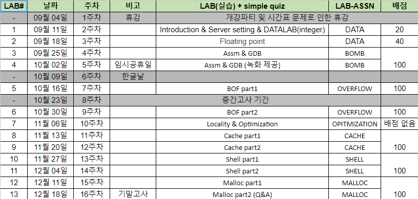

# CSED211(Intro. to Computer SW Systems)

## Objective
This course provides a programmer's view of how computer systems execute programs, store information, and communicate. It enables students to become more effective programmers, especially in dealing with issues of performance, portability and robustness. It also serves as a foundation for courses on compilers, networks, operating systems, and computer architecture, where a deeper understanding of systems-level issues is required. Topics covered include: machine-level code and its generation by optimizing compilers, performance evaluation and optimization, computer arithmetic, memory organization and management, networking technology and protocols, and supporting concurrent computation

## Professor
Name: Jisung Park  
Homepage: http://jisungpark.kr

## LAB Schedule
There are 7 lab assignments.
1. Data Lab-1
2. Data Lab-2
3. Bomb Lab
4. Attack Lab
5. Cache Lab
6. Shell Lab
7. Malloc Lab

## Reference
"Computer Systems: A Programmer's Perspective" (3rd edition) by Randal Bryant and David O'Hallaron.

## Lecture Schedule
Week 1: Introduction, Integer representation  
Week 2: Integer, Floating-point representation  
Week 3: Floating-point, Machine-level Basic (history, ISA concept)  
Week 4: Machine-level Basic (registers, instruction mov, addressing mode)  
Week 5: Arithmetic & Control instructions, Procedure Realization  
Week 6: Procedure realization, Structured Data realization (Array, Structure, Union...)  
Week 7: Advanced Topics (Memory Layout, Buffer Overflow)  
Week 8: Mid-term Exam, Memory Hierarchy  
Week 9: Cache Memories, Linking  
Week 10: Exceptions & Processes, Non-loacl Jump  
Week 11: I/O Sub-device control  
Week 12: Virtual Memory  
Week 13: Virtual Memory (cont.), Dynamic MA  
Week 14: Dynamic MA (cont.), Networking  
Week 15: Program optimization, Thread-level Parallelism  
Week 16: Final exam
